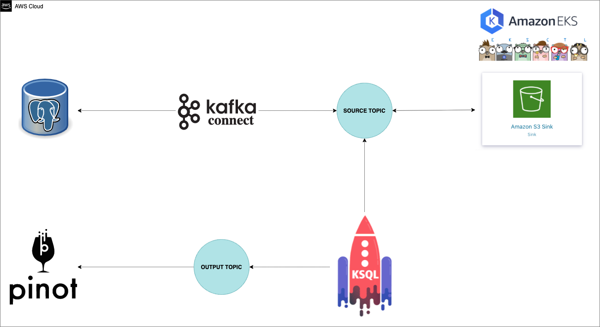

  

<h3 align="center">Bootcamp Engenheiro(a) de Dados Cloud - IGTI - Módulo 2</h3>

---

## 📝 Conteúdo

- [Arquitetura](#architeture)
- [Autor](#authors)

## Arquitetura Orientada a Eventos 

## ⛏️ Built Using 

- EKS
- Kafka Strimzi Operator
- Apache Pinot
- KsqlDB
- Python 

## ✍️ Authors 

- [@carlosbpy](https://github.com/carlosbpy)# igti-ks8-exercício-01
